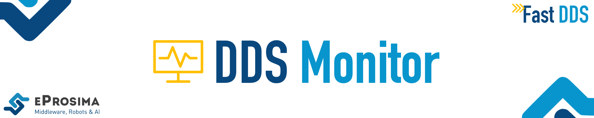
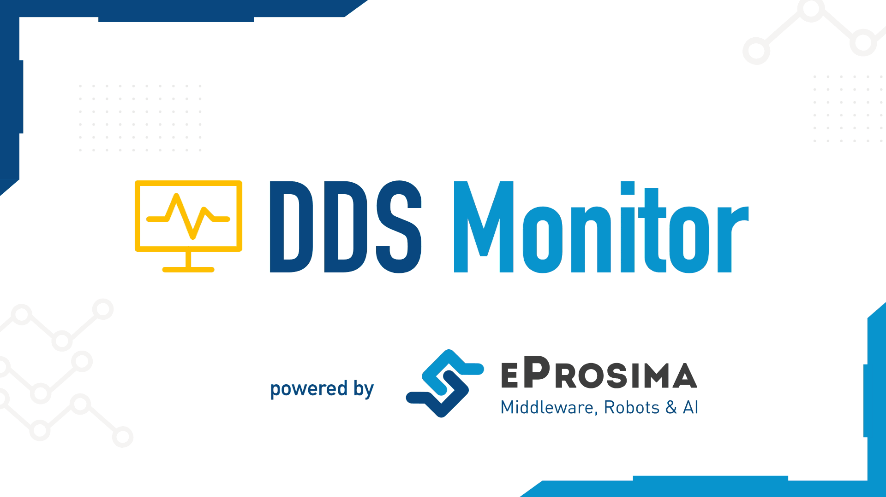

 <!-- TODO update web link -->

 

    <strong>
        <a href="https://eprosima.com/index.php/downloads-all">Download</a>
        &nbsp;&nbsp;•&nbsp;&nbsp;
        <a href="https://dds-monitor.docs.eprosima.com/en/latest/">Docs</a>
        &nbsp;&nbsp;•&nbsp;&nbsp;
        <a href="https://eprosima.com/index.php/company-all/news">News</a>
        &nbsp;&nbsp;•&nbsp;&nbsp;
        <a href="https://www.linkedin.com/company/eprosima">LinkedIn</a>
        &nbsp;&nbsp;•&nbsp;&nbsp;
        <a href="mailto:info@eprosima.com">Contact Us</a>
        &nbsp;&nbsp;•&nbsp;&nbsp;
        <a href="https://www.eprosima.com/contact-us">Request Pro Evaluation</a>
    </strong>

  

    
    
    
    
    
     
    
    

  

*eProsima DDS Monitor* is a graphical desktop application aimed at monitoring DDS environments deployed using the
*eProsima Fast DDS* library.
Thus, the user can monitor in real time the status of publication/subscription communications between DDS entities.
They can also choose from a wide variety of communication parameters to be measured (latency, throughput, packet loss,
etc.), as well as record and compute in real time statistical measurements on these parameters
(mean, variance, standard deviation, etc.).

Furthermore, the user can check the status of the deployed DDS network at any time, i.e. see for each DDS
Domain which DomainParticipants are instantiated, as well as their publishers and subscribers and the topics
they publish under or they subscribe to, respectively.
It is also possible to visualize the physical architecture of the network on which the DDS applications that use *Fast DDS*
are running.

*eProsima DDS Monitor* is designed to meet the following criteria:

* **Monitoring**: real-time tracking of network status and DDS communication.
* **Intuitive**: graphical user interface developed following a user experience design approach.
* **Introspection**: easily navigate through the deployed and active DDS entities being able to inspect their
   configuration and physical deployment.
* **Troubleshooting**: detect at a glance the possible issues or anomalous events that may occur in the communication.

    

*DDS Monitor Pro* is the commercial edition of *eProsima DDS Monitor*, building on the open-source version with
more advanced monitoring capabilities, a richer interface, and tooling designed for real production deployments.
It adds a modern dockable pane workspace, dark mode theming, and the ability to monitor multiple DDS Domains,
Discovery Servers, or XML-configured environments side by side in the same session.
Pro also unlocks offline analysis of recorded DDS traffic (MCAP/SQLite), on-demand statistics readers, custom
JavaScript-driven data series, an image pane for live topic visualization, and direct engineering support with
long-term maintenance.

    

## Feature Comparison

The following table summarizes the differences between *DDS Monitor* and *DDS Monitor Pro*. See the
[full, interactive comparison](https://dds-monitor.docs.eprosima.com/en/latest/#feature-comparison) for more details.

|  | DDS Monitor Pro | DDS Monitor (Community) |
|---|---|---|
| Target usage | Production systems, robotics, industrial, defense | Evaluation, prototyping, development, research |
| License | Commercial (eProsima Software License Agreement) | Open Source (GPL-3.0) |
| Statistics charts | ✅ Full (dockable panes) | ✅ Full (fixed layout) |
| Spy topics | ✅ Multiple dockable panes | ✅ Single fixed tab view |
| IDL view | ✅ Multiple dockable panes | ✅ Single fixed tab view |
| Alert configuration | ✅ Configuration pane | ✅ Configuration dialog |
| DDS Domain monitoring | ✅ Multiple domains simultaneously | ⚠️ Single domain only |
| Discovery Server monitoring | ✅ Multiple servers simultaneously | ⚠️ Single server only |
| XML profile monitoring | ✅ Multiple profiles simultaneously | ⚠️ Single profile only |
| Domain graph | ✅ + Visibility control panel | ⚠️ Filter by topic only |
| Support | ✅ Direct engineering support | ❌ Community-based |
| Maintenance / LTS | ✅ Long-term support with backports | ❌ No guaranteed maintenance |
| Offline mode (open recording) | ✅ MCAP / SQLite playback | ❌ |
| Custom Series (JavaScript formulas) | ✅ | ❌ |
| On-demand statistics readers | ✅ | ❌ |
| Image Pane | ✅ | ❌ |
| Topic Charts (time series) | ✅ | ❌ |
| XY Charts (scatter plot) | ✅ | ❌ |
| Publisher Pane (publish topic data) | ✅ | ❌ |
| Register Type from IDL | ✅ | ❌ |
| Dark mode and theming | ✅ | ❌ |
| Topics panel | ✅ | ❌ |
| Workspace save & restore | ✅ | ❌ |
| Help pop-ups & tooltips | ✅ | ❌ |
| Richer user experience | ✅ Entity summary bar, tab reordering, inline pane configuration, unified menu bar, domain removal... | ❌ |

## Commercial Support and Licenses

*DDS Monitor Pro* is distributed under the **eProsima Software License Agreement** and requires a valid license to
run.

To get a commercial license or to request commercial support, reach out to eProsima through any of the following
channels:

* **License request form:** [share your contact details](https://forms.eprosima.com/reach/form/CommercialSupportRequest/formperma/Ac8GwewD7PTDadQZIV92qDEzNFfMlJnYmA029mSJtJ8)
* **Email:** info@eprosima.com
* **Web:** [eProsima's webpage](https://eprosima.com/)

The open-source *DDS Monitor* is a separate product distributed under the GPL-3.0 license and does not require a
commercial license.

---

## Documentation

You can access the documentation online, which is hosted on [Read the Docs](https://dds-monitor.docs.eprosima.com/en/latest/index.html).

* [Installation Manual](https://dds-monitor.docs.eprosima.com/en/latest/rst/installation/linux.html)
* [Getting Started](https://dds-monitor.docs.eprosima.com/en/latest/rst/getting_started/entities.html)
* [DDS Monitor Pro](https://dds-monitor.docs.eprosima.com/en/latest/rst/user_manual/pro/pro_features.html)
* [DDS Monitor Basic](https://dds-monitor.docs.eprosima.com/en/latest/rst/user_manual/initialize_monitoring.html)
* [Developer Manual](https://dds-monitor.docs.eprosima.com/en/latest/rst/developer_manual/installation/sources/linux.html)
* [ROS 2](https://dds-monitor.docs.eprosima.com/en/latest/rst/ros/ros.html)
* [Docker Image](https://dds-monitor.docs.eprosima.com/en/latest/rst/docker/docker.html)
* [Release Notes](https://dds-monitor.docs.eprosima.com/en/latest/rst/notes/notes.html)
