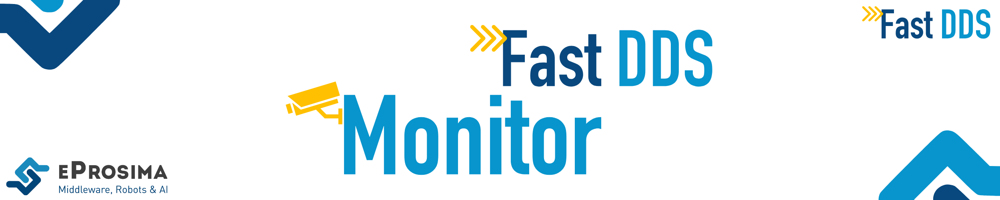

 

    <strong>
        <a href="https://eprosima.com/index.php/downloads-all">Download</a>
        &nbsp;&nbsp;•&nbsp;&nbsp;
        <a href="https://fast-dds-monitor.readthedocs.io/en/latest/">Docs</a>
        &nbsp;&nbsp;•&nbsp;&nbsp;
        <a href="https://eprosima.com/index.php/company-all/news">News</a>
        &nbsp;&nbsp;•&nbsp;&nbsp;
        <a href="https://twitter.com/EProsima">Twitter</a>
        &nbsp;&nbsp;•&nbsp;&nbsp;
        <a href="mailto:info@eprosima.com">Contact Us</a>
    </strong>

  

    
    
    
    
    
     
    
    

  

*eProsima Fast DDS Monitor* is a graphical desktop application aimed at monitoring DDS environments deployed using the
*eProsima Fast DDS* library.
Thus, the user can monitor in real time the status of publication/subscription communications between DDS entities.
They can also choose from a wide variety of communication parameters to be measured (latency, throughput, packet loss,
etc.), as well as record and compute in real time statistical measurements on these parameters
(mean, variance, standard deviation, etc.).

Furthermore, the user can check the status of the deployed DDS network at any time, i.e. see for each DDS
Domain which DomainParticipants are instantiated, as well as their publishers and subscribers and the topics
they publish under or they subscribe to, respectively.
It is also possible to visualize the physical architecture of the network on which the DDS applications that use *Fast DDS*
are running.

*eProsima Fast DDS Monitor* is designed to meet the following criteria:

* **Monitoring**: real-time tracking of network status and DDS communication.
* **Intuitive**: graphical user interface developed following a user experience design approach.
* **Introspection**: easily navigate through the deployed and active DDS entities being able to inspect their
   configuration and physical deployment.
* **Troubleshooting**: detect at a glance the possible issues or anomalous events that may occur in the communication.

    

## Commercial support

Looking for commercial support? Write us to info@eprosima.com

Find more about us at [eProsima’s webpage](https://eprosima.com/).

---

## Documentation

You can access the documentation online, which is hosted on [Read the Docs](https://fast-dds-monitor.readthedocs.io/en/latest/index.html).

* [Installation Manual](https://fast-dds-monitor.readthedocs.io/en/latest/rst/installation/linux.html)
* [Getting Started](https://fast-dds-monitor.readthedocs.io/en/latest/rst/getting_started/entities.html)
* [User Manual](https://fast-dds-monitor.readthedocs.io/en/latest/rst/user_manual/initialize_monitoring.html)
* [Developer Manual](https://fast-dds-monitor.readthedocs.io/en/latest/rst/developer_manual/installation/sources/linux.html)
* [ROS 2](https://fast-dds-monitor.readthedocs.io/en/latest/rst/ros/ros.html)
* [Docker Image](https://fast-dds-monitor.readthedocs.io/en/latest/rst/docker/docker.html)
* [Release Notes](https://fast-dds-monitor.readthedocs.io/en/latest/rst/notes/notes.html)
